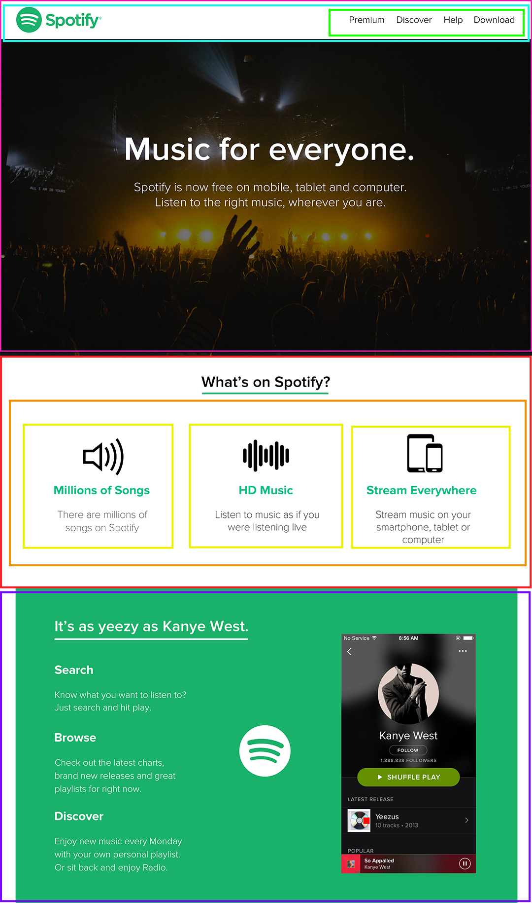

# HTML & CSS - Spotify Clone

## Introduction

Everybody likes music, right? Odds are, if you do, you have heard of **Spotify**.

In this lab, we will be building a simplified version of the Spotify landing page:



<br>

## Requirements

- Fork this repo
- Clone this repo

## Submission

Upon completion, run the following commands:

```shell
$ git add .
$ git commit -m "done"
$ git push origin master
```

Create Pull Request so that we can check up your work.

## Instructions

You are provided with some assets - in the `images` folder, you will find the necessary images, and the text is ready for you in the `index.html` file. Write your HTML and CSS code in the `index.html` and `styles/style.css` files, respectively.

The page is split into 4 sections, and we have cut it down into pieces!

In general, website designs don't just come out the wild, so you will most likely be having mockups/sketches that you will have to integrate. It is a good practice to help you out before coding to cut the website into pieces in order to help you out _**structuring**_ your HTML.

_**The last section isn't as detailed as the others ones, good luck**_ :smile:

<br>

Let's do this!

### Iteration 1: Navbar

- The navbar should be `position: fixed`.
- Align the logo to the left and the `ul` with the links to the right, either using `float` or `flex`.

### Iteration 2: Large image background with text

- Check out [this guide](https://css-tricks.com/centering-css-complete-guide/) on centering things.

### Iteration 3: What is on Spotify section

- It looks like the `div`s take up about a third of the container each. How can you represent this in code?

### Iteration 4: The green section

- It looks like we have 2 main sections, a containing element with the text flowing from top to bottom, and the image of the Spotify player on the right.
- Position the Spotify logo absolutely according to the _green_ `div`.

Happy coding! :heart:
